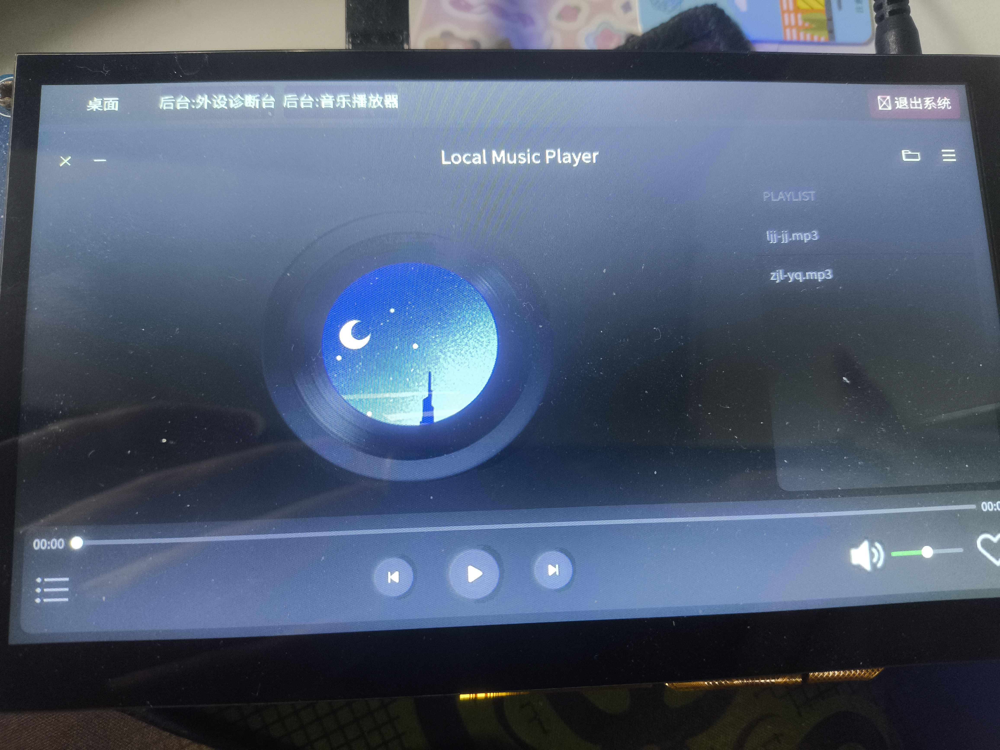
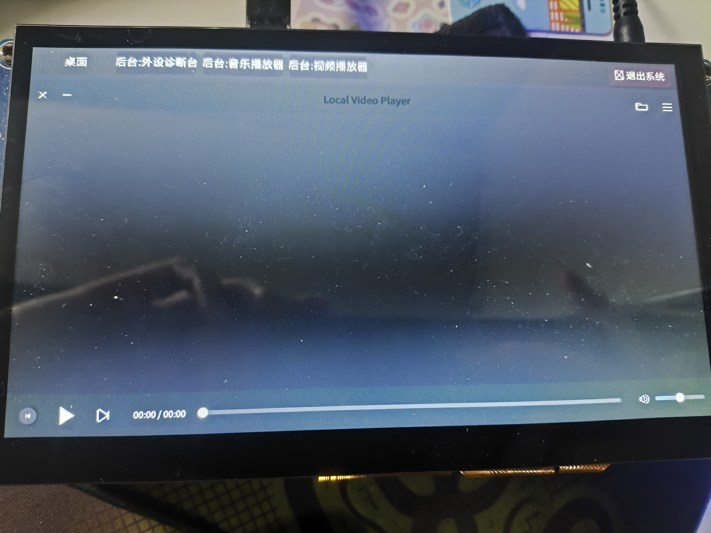
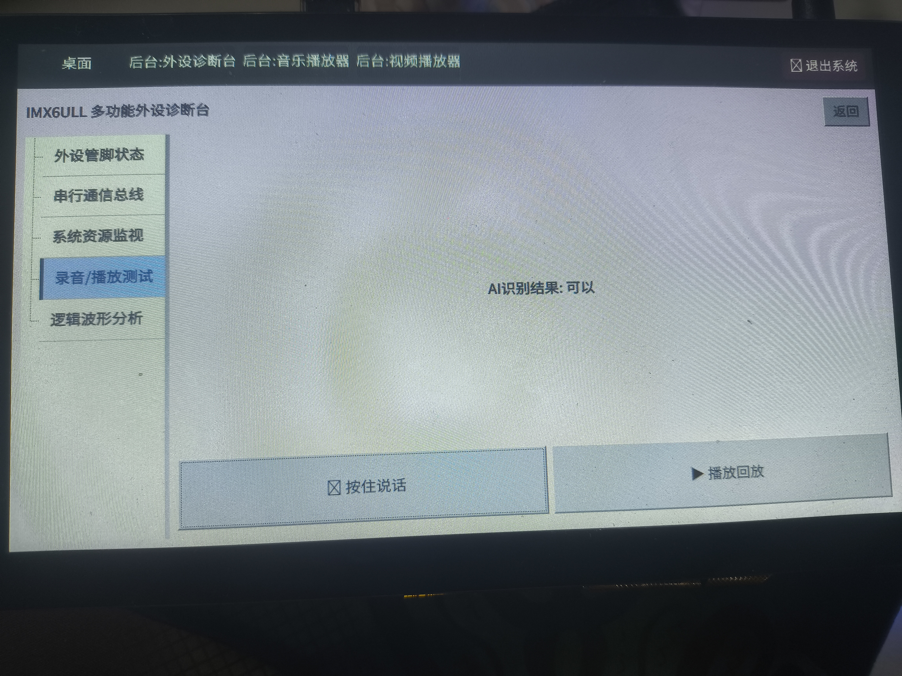

<!-- PROJECT SHIELDS -->

[![Contributors][contributors-shield]][contributors-url]
[![Forks][forks-shield]][forks-url]
[![Stargazers][stars-shield]][stars-url]
[![Issues][issues-shield]][issues-url]
[![Unlicense License][license-shield]][license-url]
[![LinkedIn][linkedin-shield]][linkedin-url]

<!-- PROJECT LOGO -->
 

  

  <h3 align="center">promise-157</h3>

  

    基于imx6ull的qt工程
     
    <a href="https://github.com/promise-157/imx6ull_lab"><strong>Explore the docs »</strong></a>
     
     
    <a href="https://github.com/promise-157/imx6ull_lab">View Demo</a>
    &middot;
    <a href="https://github.com/promise-157/imx6ull_lab/issues/new?labels=bug&template=bug-report---.md">Report Bug</a>
    &middot;
    <a href="https://github.com/promise-157/imx6ull_lab/issues/new?labels=enhancement&template=feature-request---.md">Request Feature</a>
  

<!-- TABLE OF CONTENTS -->

  
Table of Contents

  <ol>
    <li>
      <a href="#about-the-project">About The Project</a>
      <ul>
        <li><a href="#built-with">Built With</a></li>
      </ul>
    </li>
    <li>
      <a href="#getting-started">Getting Started</a>
      <ul>
        <li><a href="#prerequisites">Prerequisites</a></li>
      </ul>
    </li>
    <li><a href="#usage">Usage</a></li>
  </ol>

<!-- ABOUT THE PROJECT -->
## About The Project
基于正点原子imx6ull-emmc alpha开发板和ai实现的试验性质项目，如果讨厌ai写的代码的可以不用看下去了。实现内容为：
- ui
- 虚拟终端含键盘
- 音视频
- 语音识别与录制
- 板级资源管理

下面是效果图：

(<a href="#readme-top">back to top</a>)

碎碎念：
Q：为啥不继续搞摄像头和网络了？
A：感觉是重复工作了意义不大

使用了https://github.com/Acoucou/imx6ull_project.git这个项目里的一些图片视频等资源，如果侵权请联系我删除。
### Built With

- QT5.12.9
- ncnn
- sherpa-ncnn-streaming-zipformer-zh-14M-2023-02-23
- vscode

(<a href="#readme-top">back to top</a>)

<!-- GETTING STARTED -->
## Getting Started

### Prerequisites

1. 请查阅正点原子的官方教程，安装好交叉编译链与qt，并明确编译工具的安装路径。
2. 对于语音识别，由于文件太大了上传不了，因此需要你重新安装编译，建议参考docs文档中AI_Sherpa_NCNN_Build_Guide，这是ai写的步骤，当时我编译器出来问题因此采用的是scripts所示的两个脚本安装，使用这两个脚本时请阅读后移动至合适的目录下运行。对于下载的模型使用则参考imx6ull_lab/src/components/service/CMakeLists.txt的配置文件。

<!-- USAGE EXAMPLES -->
## Usage

1. 在板子的/home/root/model路径移植好模型文件，见/imx6ull_lab/src/3rdparty/model。
2. 运行正点原子官方的脚本开启语音功能：文件见/imx6ull_lab/scripts/mic_in_config.sh。
3. ps -ef找到/opt/ui/systemui进程，使用kill -9 "pid号",关闭原先运行的qt进程。
4. 使用setsid ./your_app -platform linuxfb &
> 本项目采用了toolchain，因此提供了一个在x86上简易查看ui设计的test工程，不过比较粗糙，感兴趣可以完善一下。如果对于怎么在vscode写qt代码有疑问欢迎提问，因为正点原子的教程貌似没有讲，我其实有写了教程在我的博客但是太粗糙就不推荐观看了。

(<a href="#readme-top">back to top</a>)

See the [open issues](https://github.com/promise-157-157/imx6ull_lab/issues) for a full list of proposed features (and known issues).

(<a href="#readme-top">back to top</a>)

<!-- MARKDOWN LINKS & IMAGES -->
<!-- https://www.markdownguide.org/basic-syntax/#reference-style-links -->
[contributors-shield]: https://img.shields.io/github/contributors/promise-157/imx6ull_lab.svg?style=for-the-badge
[contributors-url]: https://github.com/promise-157/imx6ull_lab/graphs/contributors
[forks-shield]: https://img.shields.io/github/forks/promise-157/imx6ull_lab.svg?style=for-the-badge
[forks-url]: https://github.com/promise-157/imx6ull_lab/network/members
[stars-shield]: https://img.shields.io/github/stars/promise-157/imx6ull_lab.svg?style=for-the-badge
[stars-url]: https://github.com/promise-157/imx6ull_lab/stargazers
[issues-shield]: https://img.shields.io/github/issues/promise-157/imx6ull_lab.svg?style=for-the-badge
[issues-url]: https://github.com/promise-157/imx6ull_lab/issues
[license-shield]: https://img.shields.io/github/license/promise-157/imx6ull_lab.svg?style=for-the-badge
[license-url]: https://github.com/promise-157/imx6ull_lab/blob/master/LICENSE.txt
[linkedin-shield]: https://img.shields.io/badge/-LinkedIn-black.svg?style=for-the-badge&logo=linkedin&colorB=555
[linkedin-url]: https://linkedin.com/in/promise-157
[Next.js]: https://img.shields.io/badge/next.js-000000?style=for-the-badge&logo=nextdotjs&logoColor=white
[Next-url]: https://nextjs.org/
[React.js]: https://img.shields.io/badge/React-20232A?style=for-the-badge&logo=react&logoColor=61DAFB
[React-url]: https://reactjs.org/
[Vue.js]: https://img.shields.io/badge/Vue.js-35495E?style=for-the-badge&logo=vuedotjs&logoColor=4FC08D
[Vue-url]: https://vuejs.org/
[Angular.io]: https://img.shields.io/badge/Angular-DD0031?style=for-the-badge&logo=angular&logoColor=white
[Angular-url]: https://angular.io/
[Svelte.dev]: https://img.shields.io/badge/Svelte-4A4A55?style=for-the-badge&logo=svelte&logoColor=FF3E00
[Svelte-url]: https://svelte.dev/
[Laravel.com]: https://img.shields.io/badge/Laravel-FF2D20?style=for-the-badge&logo=laravel&logoColor=white
[Laravel-url]: https://laravel.com
[Bootstrap.com]: https://img.shields.io/badge/Bootstrap-563D7C?style=for-the-badge&logo=bootstrap&logoColor=white
[Bootstrap-url]: https://getbootstrap.com
[JQuery.com]: https://img.shields.io/badge/jQuery-0769AD?style=for-the-badge&logo=jquery&logoColor=white
[JQuery-url]: https://jquery.com 
